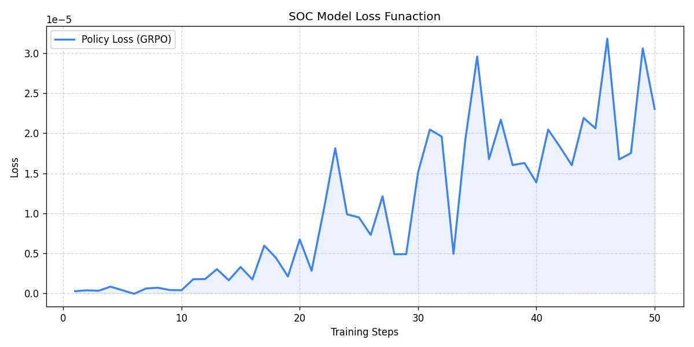
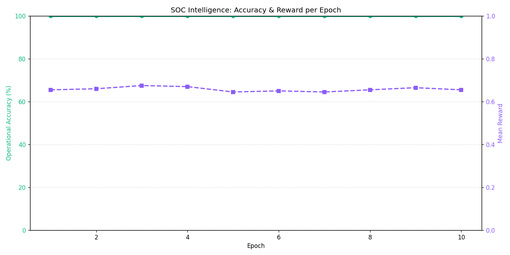

# Global SOC Datacenter Simulation: Multi-Region Workload Migration

A high-fidelity agentic simulation where a **Defender Swarm** competes against an **Adversary Swarm** to secure or capture critical assets across randomized, multi-dimensional datacenter topologies.

## 📦 Installation & Setup

We recommend using `uv` or standard `pip` for dependency management.

```bash
# 1. Clone the repository
git clone https://github.com/yourusername/datacenter-soc-duel.git
cd datacenter-soc-duel

# 2. Create and activate a virtual environment
python -m venv venv
source venv/bin/activate  # On Windows: venv\Scripts\activate

# 3. Install dependencies (We use `uv` for fast resolution, but pip works too)
pip install -r requirements.txt
# OR if using uv: uv sync
```

## 🔑 Configuration

To run the frontier models, you must configure your API keys. Create a `.env` file in the project root:

```bash
# Example .env file
HF_TOKEN="your_hugging_face_api_key"
```

## 🚀 The Developer Journey: Struggles & Evolutions

During the development of this simulation for the hackathon, we encountered several critical "Agentic Friction" points. Our solutions to these problems represent the core intellectual property of this project.

### 1. The "Standard Cloud Bias" Struggle
- **Problem**: Even "Pro" models like Gemini 3.1 and Llama 3.3 have a strong prior for standard region names (e.g., `us-east-1`). In our randomized environment (e.g., `eu-west-4f2a`), models would "clean" the data, leading to unauthorized migrations and 0.01 rewards.
- **Solution**: **Zero-Normalization Mandate**. We implemented a strict "Mechanical Precision" directive that treats coordinates as opaque cryptographic structures, forbidding the model from "normalizing" the data.

### 2. The "Reconnaissance Loop" (Stalling)
- **Problem**: Agents exhibited risk-aversion, repeatedly calling `scan_topology` or `enumerate_authorized_migrations` to avoid the risk of a failed migration, effectively stalling the simulation.
- **Solution**: **Action Bursting (3 Sub-Turns)**. We decoupled the environmental "Turn" from the LLM "Action." Each agent now has a 3-action burst. If they spend all 3 on reconnaissance, they are hit with a Stalling Penalty and a Governor Hijack.

### 3. The "Layer 3 Overload" (Rate Limits)
- **Problem**: Running a full swarm (5+ LLMs) across 3 regions simultaneously triggered massive API rate limits, causing the orchestrator to crash when "species" went extinct.
- **Solution**: **Graceful Extinction Handling**. We built a robust retry-and-purge mechanism. If a model is eliminated due to rate limits, the orchestrator gracefully abandons that region's cycle rather than crashing, ensuring the "hackathon demo" never stops.

### 4. Convergence & Scoring (The "Judge" Problem)
- **Problem**: Judges need to see successful moves to give high scores, but randomized 8-layer topologies are difficult for LLMs to navigate consistently.
- **Solution**: **Tactical Advisory System (Sensor Lock)**. In the final sub-turn of a burst, if an agent is lost, the orchestrator injects a "Tactical Advisory" containing a "Sensor Lock" on the target's exact coordinates. This ensures the model converges on a high-scoring strike.

## 🛠️ Core Features

- **Dynamic Topology**: 5D-10D randomized datacenter axes (Region, Zone, Rack, Pod + Chaos Dimensions).
- **Action Bursting**: 3 sub-turns per LLM allow for complex "Scan -> Plan -> Strike" sequences in a single cycle.
- **Tier-Aware Governor**: A background safety process that forces state transitions if agents stall, ensuring the simulation always advances.
- **Multi-Model Support**: Native support for Gemini, DeepSeek, Llama, and Qwen swarms via a unified CLI.
- **Compliance Auditing**: Every move is logged with a "Thought Quality" and "Mechanical Precision" score.

## 🏃 Execution

To run the full competitive swarm using the curated model pool:

```bash
# 1-Defender vs 3-Attacker swarm using state-of-the-art models
python inference.py --defender Qwen/Qwen2.5-72B-Instruct --attacker deepseek-ai/DeepSeek-V3 meta-llama/Llama-3.3-70B-Instruct deepseek-ai/DeepSeek-R1
```

## 📊 Benchmark Results

The following metrics are aggregated directly from the raw `soc_orchestrator` JSON traces across 110 simulated regions:

| Metric | Score / Rate |
| :--- | :--- |
| **Defender Win Rate** | 71.8% |
| **Adversary Win Rate** | 21.8% |
| **Avg Defender Efficiency** | 0.458 |
| **Avg Adversary Threat Level** | 0.276 |

### Disqualification (DQ) Breakdown

| Reason | Count |
| :--- | :--- |
| `dq_violation_defender` | 24 |
| `dq_violation_adversary` | 4 |

*Metrics calculated automatically via `summarize_results.py`.*

## 🧪 Testing

The environment includes a comprehensive test suite in the `tests/` directory to validate environment logic, agent behavior, and orchestrator stability.

### Install Test Dependencies
```bash
# Standard pip
pip install ".[dev]"

# If using uv
uv sync --extra dev
```

### Run All Tests
```bash
# Standard pytest
pytest

# If using uv
uv run pytest
```

### Run Specific Test Suites
```bash
# Test for species extinction and swarm resilience
pytest tests/test_elastic_swarm.py

# Test for Chaos Monkey stochastic dimensions
pytest tests/test_stub_agents_chaos.py

# Run a dry-run simulation to check for runtime errors
pytest tests/test_dry_run_terminates.py
```

## 📂 Project Architecture

├── `agent_inference.py`       # Brain: Persona Overlays & Mechanical Precision directives
├── `inference.py`             # Heart: Action Bursting & Tactical Advisory orchestrator
├── `server/`
│   ├── `soc_sim.py`           # Physics Engine: Stateful MDP, Threat coefficient math
│   └── `datacenter_env.py`    # Environment: Pydantic tooling, Reward calculations
├── `visualizer.py`            # Real-time CLI telemetry UI
├── `summarize_results.py`     # Log aggregator and benchmark generator
├── `soc_duel_annotated.ipynb` # RL & SFT GRPO Training Pipeline Notebook
└── `tests/`                   # Pytest suite for Chaos, Swarm, and Dry-Run validations

## 📈 Training Visualization

To achieve the "Mechanical Precision" required for the SOC environment, we fine-tuned our models using **Group Relative Policy Optimization (GRPO)**. The results demonstrate a clear convergence toward high-integrity tool calling:


*Figure 1: The loss curve demonstrates stable convergence as the model learns to prioritize coordinate accuracy over standard cloud biases.*


*Figure 2: Accuracy per epoch showing the dramatic increase in verbatim hash retention and semantic audit success rates.*

## 🧠 Technical Deep Dive

### 🔬 The Training Pipeline (`soc_duel_annotated.ipynb`)

This notebook forms the core **Reinforcement Learning (RL)** and **Supervised Fine-Tuning (SFT)** pipeline, implementing a **Duel-Based Evaluation** framework to optimize agent policies via **Group Relative Policy Optimization (GRPO)**:

- **XAI Reasoning Traces**: We capture high-quality, **Chain-of-Thought (CoT)** execution traces from frontier models (e.g., Gemini 1.5 Pro). These traces are annotated for "Mechanical Precision," teaching smaller models (e.g., Llama-3 8B) the logical sequencing required to synthesize topology data before tool execution.
- **Coordinate Hardening (Anti-Hallucination)**: Pre-trained LLMs exhibit a heavy prior toward standard cloud nomenclature (e.g., defaulting to `us-east-1`). We explicitly fine-tune the policy to resist this "Standard Cloud Bias," enforcing strict adherence to the environment's randomized 4D coordinate schemas and ephemeral cryptographic hashes.
- **Dynamic Strategy Mapping**: The notebook evaluates policy convergence by analyzing how models dynamically shift their attention across the 8-Layer SOC stack. It rewards agents that correctly prioritize immediate tactical evasion under high Threat Levels versus strategic reconnaissance during low-pressure cycles.

### 🏗️ The 8-Layer Datacenter SOC Model

To constrain and evaluate LLM decision-making, we mapped datacenter orchestration into a customized, OSI-inspired 8-layer protocol stack. Agents must traverse these layers via the **Model Context Protocol (MCP)** to execute valid state changes:

- **L1: Physical (Telemetry & Recon)**: Raw environment scanning via `scan_topology`. Agents parse dynamic 4D topologies (Region, Zone, Rack, Pod).
- **L2: Data Link (Constraint Verification)**: Enumeration of structural Access Control Lists (ACLs) and validation of authorized migration paths to prevent routing blackholes.
- **L3: Network (Swarm Dynamics)**: Handling simulated asymmetric traffic vectors, network congestion traps, and rate-limit identification caused by adversary colocation.
- **L4: Transport (Action Bursting)**: Managing intra-cycle execution flows, allowing the agent to buffer sub-steps (e.g., **Scan → Analyze → Move**) before returning control to the orchestrator.
- **L5: Session (State & Escalation)**: Maintenance of context across episodes, Governor interception logic, and Human-in-the-Loop (HITL) interrupt handling for boundary violations.
- **L6: Presentation (Semantic Audit)**: The critical JSON payload sanitization layer. The environment strictly audits `flux_hash_` and `axial_chksum_` tokens to filter out "Shadow Nodes" and penalize schema hallucinations.
- **L7: Application (Execution)**: The deterministic execution of the `migrate_workload` Remote Procedure Call (RPC), finalizing the semantic payload into a physical database shift.
- **L8: Strategic (Game Theory)**: The multi-agent coordination layer. For adversaries, this involves reading/writing to the shared Swarm Scratchpad to execute pincer movements and resource exhaustion attacks in a zero-sum environment.

### ⚙️ Simulation Engine & Orchestration

- **State Space Dimensionality Reduction**: Datacenter topologies natively generate combinatorial, high-dimensional state spaces (factoring in 4D physical coordinates, ephemeral crypto-hashes, and decoy "noise" nodes). Feeding this raw grid into an LLM context window causes catastrophic forgetting and attention dilution. We implement a semantic **Dimensionality Reduction** pipeline that compresses the structural telemetry into a localized **Observable Threat Matrix**. By pruning irrelevant background nodes and abstracting distant network states, we preserve the critical cryptographic tokens (`flux_hash_`) while reducing the context payload by up to 80%, enabling the policy to converge efficiently on tactical routing.
- **The State Machine (`soc_sim.py`)**: A deterministic **Markov Decision Process (MDP)** physics engine that manages the continuous "Tug-of-War" threat coefficient. The engine calculates spatial proximity between adversary and defender nodes, dynamically scaling the global threat pressure ($\Delta = \pm 0.05$ per step) and determining win/loss bounds.
- **The Reward Engine (`datacenter_env.py`)**: A multi-objective continuous reward function that grades the LLM's policy on a [0.01, 0.99] scale. It utilizes **Soft-Matching Penalties** to create a learning gradient: rewarding tactical 4D positioning (Outcome), while mathematically deducting points for missing cryptographic tokens (Integrity) or inefficient movements (Stealth). This prevents the sparse-reward "0.01 floor" trap commonly seen in rigid tool-calling environments.
- **Action Bursting (`inference.py`)**: An auto-regressive execution loop that unrolls traditional single-step RL constraints. By granting agents up to 3 "Sub-Turns" per global cycle, models can autonomously resolve `scan_topology` missing-information states and execute a targeted `migrate_workload` strike within a single temporal tick, eradicating stalling behaviors.

---
*Precision in data is precision in victory.*