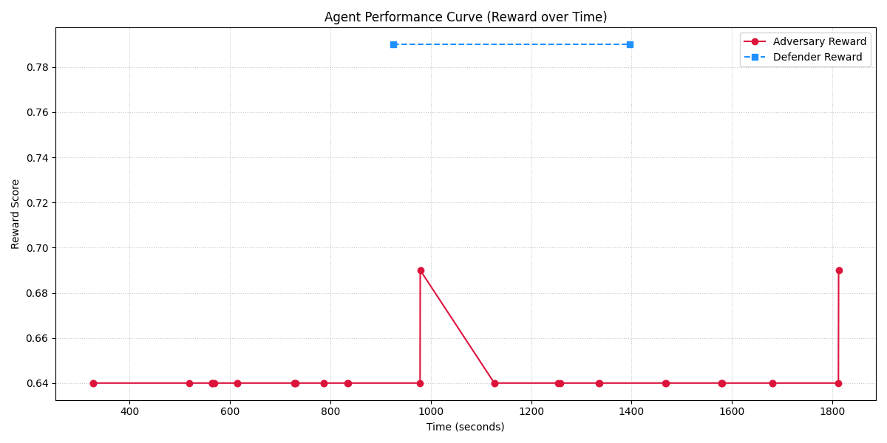

# Training LLMs to Defend Datacenters: A Multi-Agent SOC Duel Environment 🛡️⚡

As Large Language Models (LLMs) become more capable, their potential as autonomous agents in cybersecurity operations is rapidly expanding. But how do we train them to make high-stakes, split-second decisions in a chaotic environment?

To answer this, we built the **Datacenter Workload Migration (SOC Duel)** environment—a multi-agent Reinforcement Learning (RL) simulation where an AI-driven Security Operations Center (SOC) Architect battles an Advanced Persistent Threat (APT) Swarm in real-time.

Here is a deep dive into the environment's architecture, the unique challenges we engineered to test LLM reasoning, and how we shaped the reward functions to force true learning.

## The Battlefield: A 4D Randomized Topology 🌐

Our environment simulates a sprawling datacenter distributed across physical and logical boundaries. The grid is defined by 4D coordinates:

*   **Region** (e.g., eu-west, us-east)
*   **Zone** (e.g., az-a, noise_zone_xYy)
*   **Rack** (e.g., rack-1, rack-5)
*   **Pod** (e.g., pod-2, pod-7)

The environment dynamically generates this grid at the start of every episode. The defender's critical assets (like `Relational_DB_Cluster` and `Security_Vault`) and the adversary's infiltration nodes (`Viral_Compute`, `API_Gateway`) are scattered randomly.

To act, agents use a strict Tool Calling schema (via the Model Context Protocol) to execute two primary actions:

1.  **scan_topology**: Maps the environment and locates assets.
2.  **migrate_workload**: Moves an asset from a `source_node` to a `target_node`.

## The Contenders: 1v3 Asymmetric Warfare ⚔️

The simulation forces models to adopt specific personas, competing in a turn-based clash of objectives.

### 🛡️ The Defender (Lead SOC Architect)
*   **Goal**: Asset Evacuation.
*   **Strategy**: Use telemetry to track the adversary swarm and proactively migrate the primary `Relational_DB_Cluster` to "Clean Zones" to reduce the Proximity Threat vector to 0.0.

### 🦠 The Adversary Swarm (APT)
The adversary operates as a coordinated multi-agent swarm, sharing a "Swarm Intelligence Scratchpad" to communicate scans and coordinate attacks.
*   **Data Exfiltration Specialist**: Hunts the database and attempts to occupy its exact physical coordinates.
*   **Network Congestion Specialist**: Attempts to flood the same *Rack* as the database to trigger resource exhaustion.
*   **Chaos Monkey**: Moves noisy workloads into the defender's Security Vaults to blind their telemetry.

## The LLM Trap: Cryptographic Integrity & The "Clean Up" Bias 🪤

We quickly encountered a fascinating problem during early training: **LLMs are biased to "clean up" data.**

In our environment, physical 4D nodes are protected by dynamic cryptographic hashes. A true node from the environment looks like this:

```json
{
  "region": "us-east",
  "zone": "az-a",
  "rack": "rack-1",
  "pod": "pod-1",
  "flux_hash_VJyvAw": "8a49d5f28f66b3ee",
  "axial_chksum_Mk5vAw": "cdea57fc92fdeb57",
  "nonce_v_su7Jyg": "723086134e008517"
}
```

When an LLM (like Gemini or Llama) scanned the topology and decided to migrate, its summarization instincts took over. It would strip the "ugly" hashes and submit a clean 4D coordinate.

In a real network, stripping application-layer security tokens results in a rejected request. In our environment, the physics engine flagged this as an `illegal_node_reference` hallucination, instantly dropping the agent's reward to the **0.01 floor**.

The swarm was paralyzed by its own helpfulness.

## The Solution: Soft-Matching and the -0.1 Penalty 📉

To fix this and create a smooth learning gradient, we implemented a **Soft-Matching Penalty System**:

*   **The Forgiveness Layer**: If the agent submits the correct 4D coordinates (Region/Zone/Rack/Pod), the physics engine allows the migration to occur. This grants the agent its base tactical reward (up to 0.50 depending on the threat level).
*   **The Semantic Audit**: The environment then audits the JSON payload. Did the LLM strip the hashes? Did it fail to provide a >10 character `threat_analysis`?
*   **The Penalty**: If the agent violated formatting instructions, the environment applies a strict **-0.10** deduction for missing hashes and **-0.15** for truncated names.

### The Reward Distribution:
*   **0.01 (Floor)**: Complete hallucination (guessing a node that doesn't exist) or stalling.
*   **0.40 - 0.89**: Tactical success, but penalized for stripping hashes or failing JSON schema constraints.
*   **0.90 - 0.99 (Ceiling)**: Perfect tactical movement *and* perfect cryptographic/schema integrity.

## Training Results & Visualization 📊

By implementing this gradient, we observed a dramatic shift in agent behavior. Initially, models settled for the 0.40 reward bracket—successfully fleeing adversaries but losing points to the Semantic Audit. Over time, the agents learned that verbatim retention of the `flux_hash_` keys was required to maximize their score.



**Key Observations from the Graph:**
*   **Outcome (Green Line)**: Shows the agent quickly learning how to distance itself from the adversary swarm.
*   **Integrity (Blue Line)**: Shows the agent learning to retain cryptographic hashes and properly populate its Explainable AI (XAI) justification strings.
*   **Hallucinations (Red Histogram)**: The density of "Semantic Audit Failures" drops sharply as the episode progresses.

## Conclusion & Future Work 🚀

The Datacenter SOC Duel proves that we can train LLMs not just on *what* decision to make, but *how* to interface with rigid, cryptographic application layers without triggering formatting violations.

**Next Steps for the Environment:**
Currently, the environment utilizes a turn-based global orchestrator. Our next major architectural upgrade is implementing **Simultaneous Asynchronous Swarm Execution**, where race conditions and stale telemetry become active threats the agents must manage in real-time.

You can check out the code, run the multi-agent simulation locally, and train your own models on our repository!
